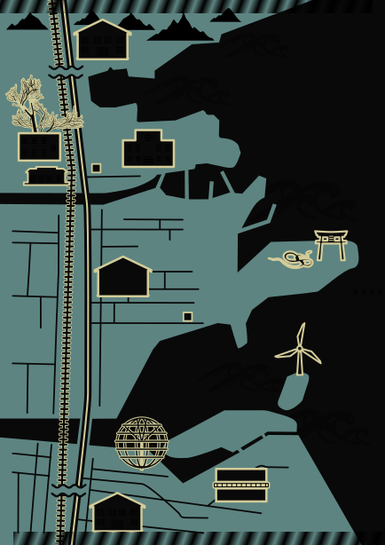

# Monogatari Map

A project for manually tracing maps that relate to the Monogatari series.

Feel free to contribute any new icons, patterns or text that could improve the maps.

## Information

> [!WARNING]
> Made with **Inkscape 1.3.2**  
> If you would like to contribute it is recommended to use the latest version of Inkscape to avoid any issues

> [!CAUTION]
> For text to properly display on Namishiro Park,  
> the font [**HGP Mincho B**](Fonts/HGPMinchoB.ttf) must be installed

The files in [References](References) and [Source](Source) are completely optional, they're only useful if you want to compare the traced path with the original source material.

### Naoetsu Town

 
*[source](https://mangandenchi.com/bakemonogatari-naoetu/)*

### Namishiro Park

 
*source: Bakemonogatari episode 3 19:09*